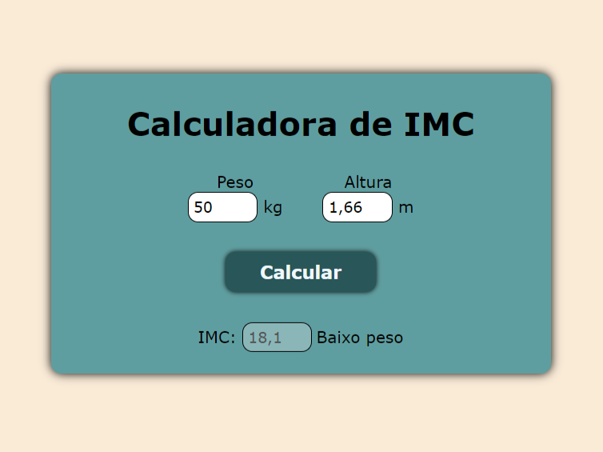

Nesse repositório estão vários pequenos projetos em JavaScript com o intuito de evoluir na fluência do código. Com isso, acabo praticando HTML e CSS também e aprendendo coisas novas quanto a ligação das 3 linguagens.

<h2>Exercício 1 - Caixa Arco-Íris</h2>
Um simples retângulo inicialmente branco, mas que vai mudando de cor conforme se apertam os botões das respectivas cores. Também tem um botão de resetar, que faz voltar pro branco.
  

<h2>Exercício 2 - Calculadora de IMC</h2>
Calcula o IMC com base na altura e no peso e retorna o valor do IMC, juntamente com uma mensagem que diz se está na magreza, normal, acima do peso ou com obesidade.
  

<h2>Exercício 3 - Calculadora de Média</h2>
Calcula a média de um aluno com base em duas notas que vão de 0 a 10 e diz se está reprovado, em recuperação ou aprovado.
  

<h2>Exercício 4 - Dado Virtual D6</h2>
Um dado virtual que sorteia um número aleatório. Tem a imagem do dado (que também mostra a face com o número sorteado) que executa uma animação em CSS quando o número está sendo sorteado.
  

<h2>Exercício 5 - Conversor de Moedas</h2>
Converte um valor em reais atribuído pelo usuário para seu respectivo valor em dólar, euro, libras ou bitcoins. O botão para a conversão só funciona se tiver sido dado um valor válido em reais e uma das opções de moedas para conversão tenha sido selecionada.
  

<h2>Exercício 6 - Quiz</h2>
Um quiz (no caso, sobre gastrópodes) com 5 perguntas e que retorna o número de pontos atingidos e uma frase a depender do seu resultado no final.
  

<h2>Exercício 7 - Página do Apple Watch</h2>
Página igual a do Apple Watch, com a mudança nas fotos do produto a depender da cor, tamanho e ângulo selecionados. Obs.: desse eu só fiz o JavaScript.
  

 
<h2>Exercício 8 - Cards de Mario</h2>
Uma página simples com cards de personagens de Mario com nome, alinhamento, imagem e cor de fundo definidas por um arquivo JSON, com valores de seus atributos buscados usando o fetch. Os cards fazem uma animação aumentando suavemente de tamanho quando se passa o mouse por cima, ficando como está a Peach na imagem.
  

